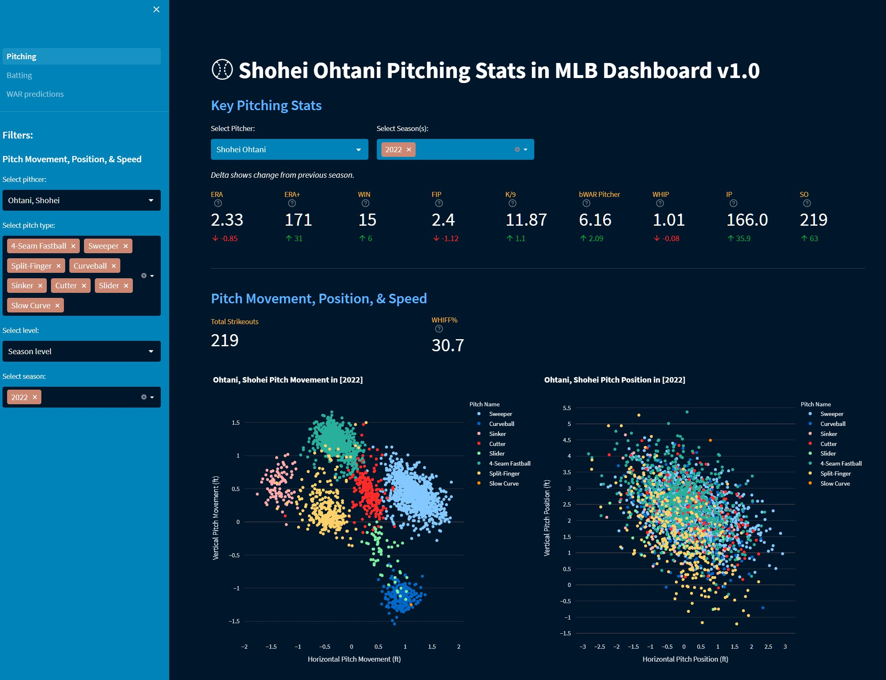
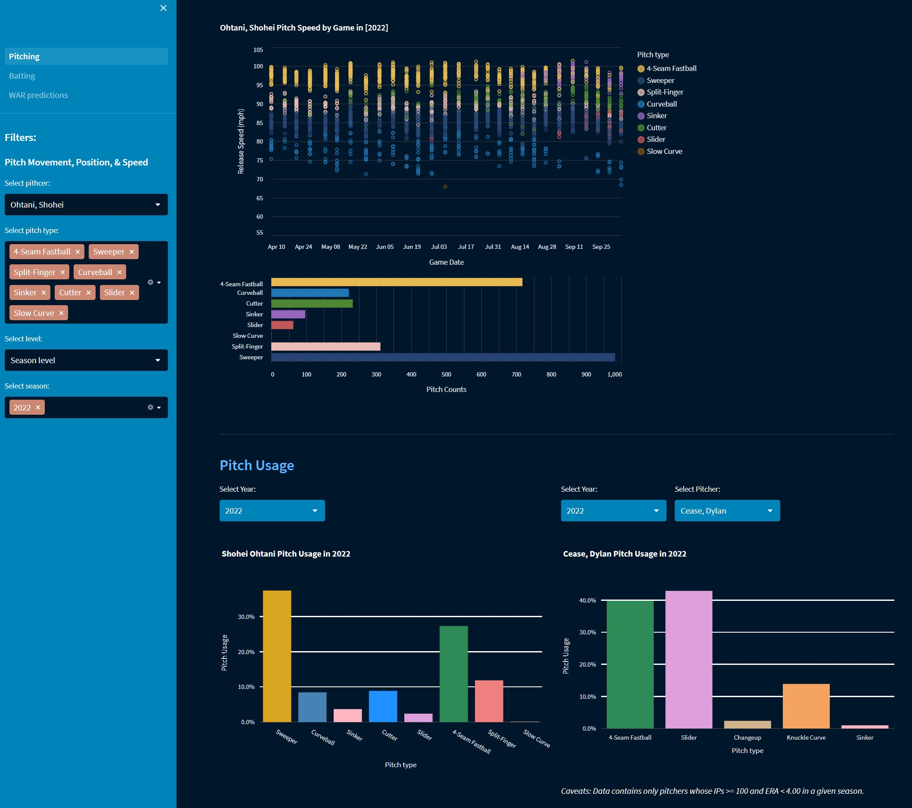
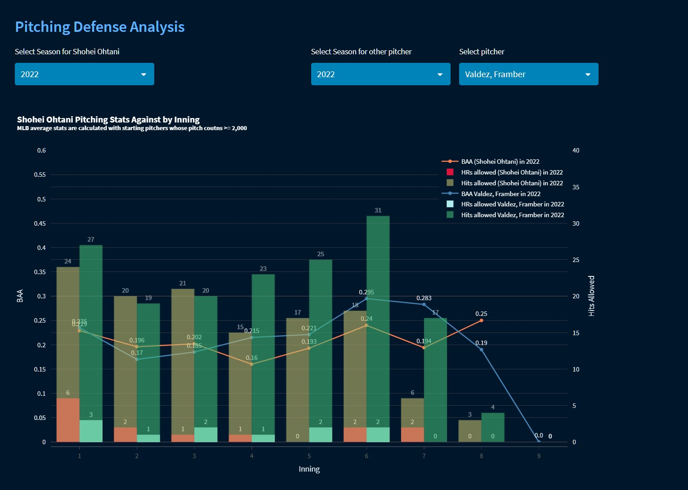
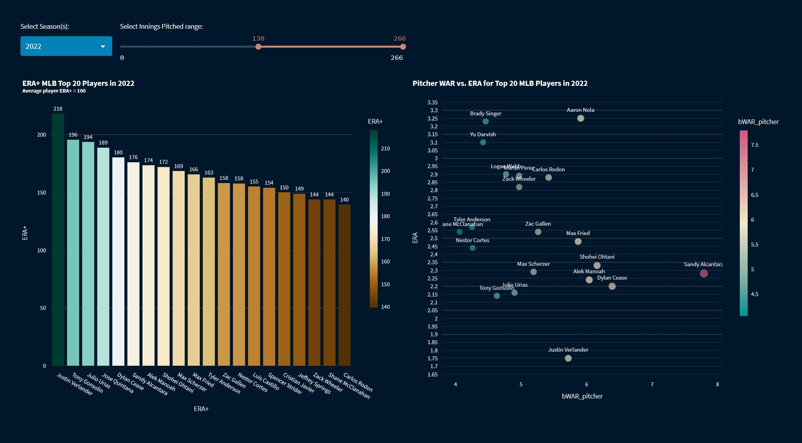
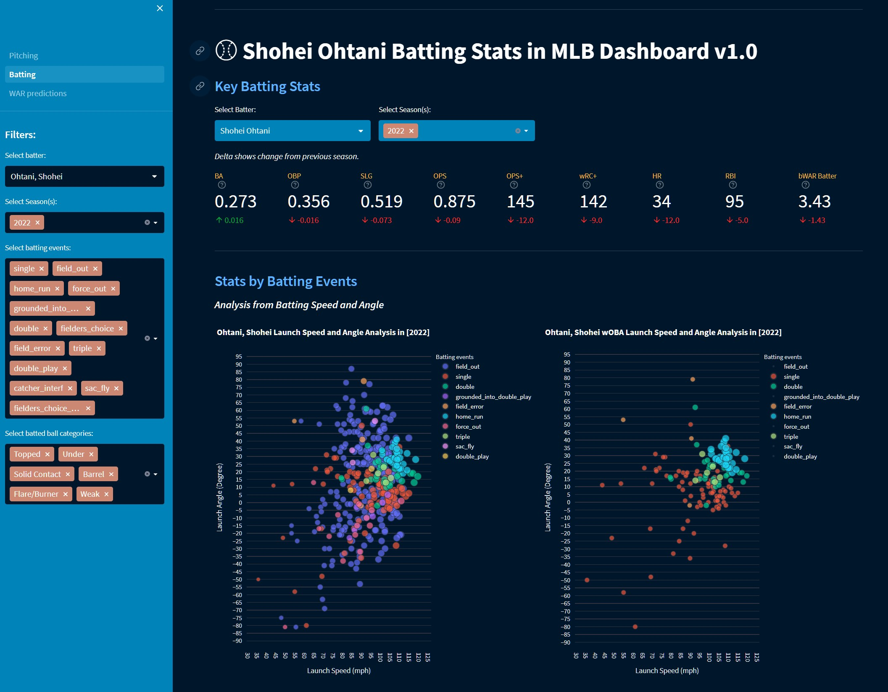
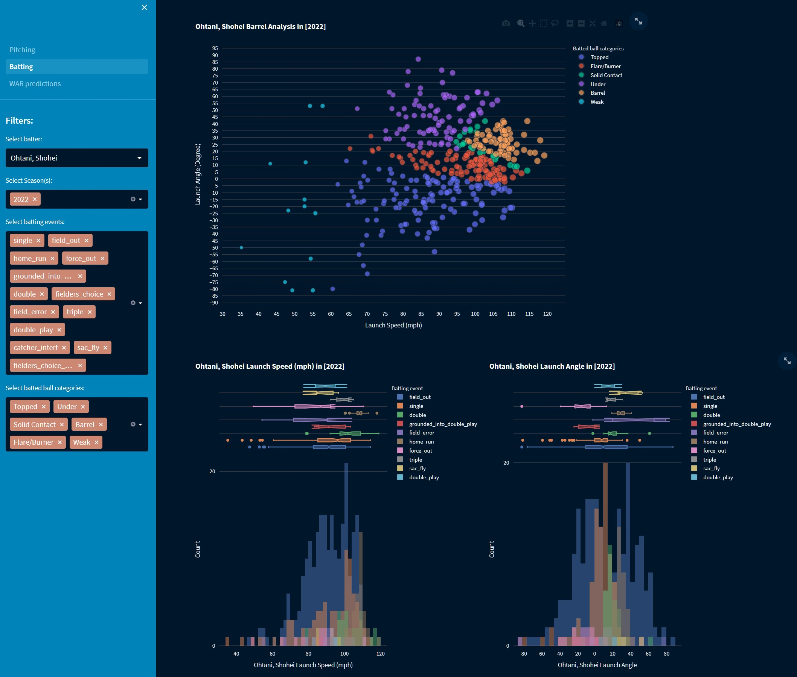
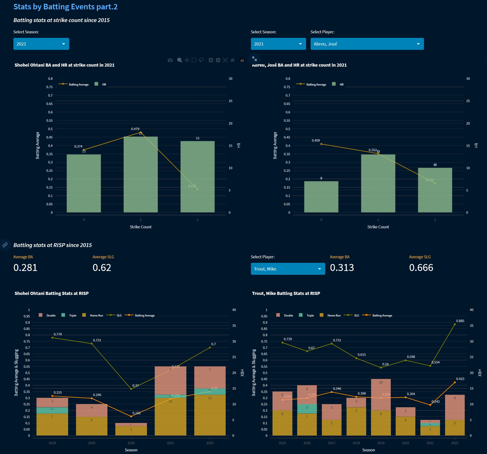

# MLB Shohei Ohtani Stats Dashboard v1.1

### Project Motivation
In this project, stats for Shohei Ohtani, a two-way player in MLB, are focused on analysis from both pitching and batting perspectives. In the dashboard, both stats are also compared with those of other top MLB players, to showcase how talented he is on both sides. 

### Dashboard app images
Screenshots samples from the dashboard are shared below.

1. Pitching 1<br>


2. Pitching 2<br>


3. Pitching 3<br>


4. Pitching 4<br>


5. Batting 1<br>


6. Batting 2<br>


7. Batting 3<br>


8. Batting 4<br>


### How to run app in local
1. Visit jupyter notebook files and create necessary data files for the app
2. Download necessary files from this repo
3. Type the command below in the directory those files are stored
```
streamlit run Pitching.py
```

### File Descriptions
Below are files for this project.

- Shohei Ohtani pitcher stats.ipynb # Pitching is analyzed and the insights are provided with visualization, which are also bases for the dashboard app.
- Shohei Ohtani batter stats.ipynb # Batting is analyzed and the insights are provided with visualization, which are also bases for the dashboard app.
- Pitching.py # a python file for Pitching page in Streamlit web app
- pages
    - 02_Batting.py # a python file for Batting page in Streamlit web app
- baseball_metrics.py # a python file for functions to generate sabermetrics
- functions.py # a python file for functions to generate dataframes necessary for building the web app
- chart_functions.py # a python file for fucntions to generate charts for each insights
- README.md

### Libraris used
The following Python libraries were used in this project.

- altair==4.2.2
- numpy==1.24.1
- pandas==1.5.2
- plotly==5.13.0
- pybaseball==2.2.5
- streamlit==1.18.1

### Dashabord app link
Please visit and find analysis and insights [here](link). *WIP. To be updated.*

### Acknowledgements
References below
- [Baseabll Reference](https://www.baseball-reference.com/)
- [FanGraphs Baseball](https://www.fangraphs.com/)
- [Baseball Savant](https://baseballsavant.mlb.com/)
- [MLB.com](https://www.mlb.com/)
- [An interactive Dashboard using python and Streamlit](https://www.youtube.com/watch?v=Sb0A9i6d320&t=5s)

