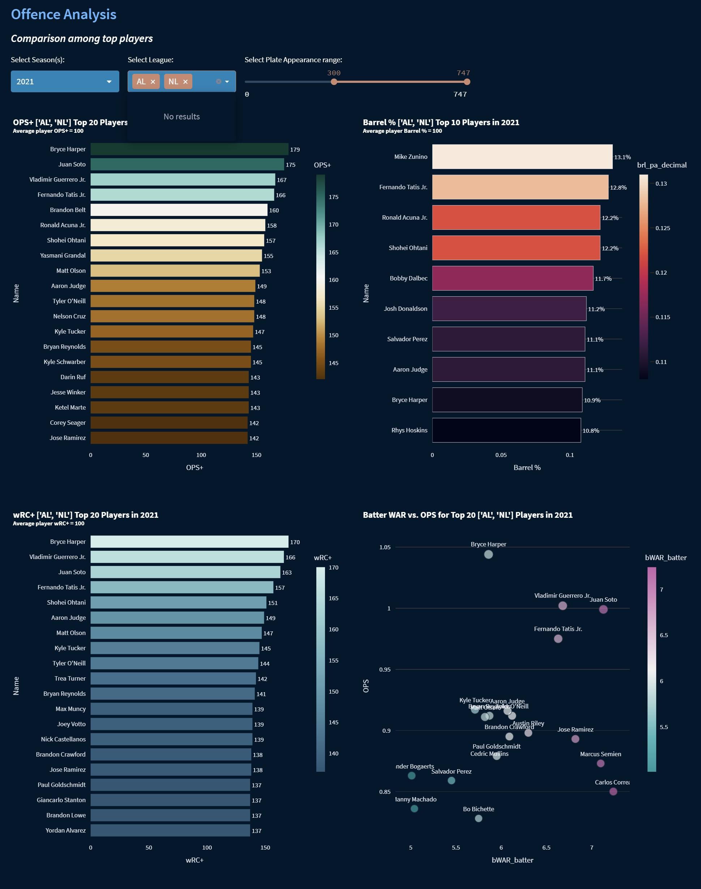

# MLB Stats Dashboard pilot

_Caveats: This is an initial pilot dashboard and data shown might be slightly different from actual stats._<br>

### Project Motivation
In this project, key baseball stats in MLB are summarized from both pitching and batting perspectives.

### Dashboard overview
The dashboard has two pages, Pitching and Batting. Sections are categorized as below.<br>
* Pitching
    * Key Pitching Stats
    * Pitch Movement, Position, & Speed<br>
    The first plot shows relationship between vertical and horizontal pitch movement by pitch name for individual pitcher,<br>
    and the second shows relationship between vertical and horizontal pitch position.<br>
    The third plot shows pitch speed by pitch type and by game.<br>
    These plots are linked with filters in the side bar.

    * Pitch Usage<br>
    In this section, pitch usage is compared with other pitchers.

    * Pitching Defense Analysis<br>
    The first plot shows pitching stats by inning at season level, focusing on three metrics BAA (Batting Average Against), HRs allowed, and hits allowed. This also allows you to compare with other pitchers.<br>
    The other two plots shows ERA+ ranking and the relationship between pitcher WAR and ERA. Season and IP (Inning Pitched) can be filtered.

* Batting
    * Key Batting Stats
    * Stats by Batting Events<br>
    The first part shows relationship between batting speed and angle by batting events such as field out, single, home run, or etc, and alo by batted ball categories such as barrel.<br>
    These plots are linked with filters in the side bar.<br>
    The second part show batting stats at strike count and at RISP (Runners In Scoring Position). These stats can be caompared with other batters.

    * Offense Analysis<br>
    This secion includes the following four plots, OPS+ ranking, Barrel % ranking, wRC+ ranking plots, and relationsihp between batter WAR and OPS.<br>
    Season, league, and PA (Plate Appearance) range can be filtered.<br>

Screenshots samples from the dashboard are shared below.

1. Pitching 1<br>


2. Pitching 2<br>


3. Pitching 3<br>


4. Pitching 4<br>


5. Batting 1<br>


6. Batting 2<br>


7. Batting 3<br>


8. Batting 4<br>


### How to run app in local
1. Download necessary files from this repo
2. Create necessary data files for the app by using the Jupyter notebooks as reference. Feel free to customerize as you want.
3. YOu can use those csv files for the dashboard as well as you can set up MongoDB and load them to a database.
4. As a default configuration, streamlit authentication with MongoDB is set. If this is not the case to you, drop the authentication section.
5. Once all resources are ready, under this project directory, type the command below in the directory those files are stored
```
streamlit run Pitching.py
```

### File Descriptions
Below are files for this project.

- Shohei Ohtani pitcher stats.ipynb # Pitching is analyzed and the insights are provided with visualization, which are also bases for the dashboard app.
- Shohei Ohtani batter stats.ipynb # Batting is analyzed and the insights are provided with visualization, which are also bases for the dashboard app.
- Pitching.py # a python file for Pitching page in Streamlit web app
- pages
    - 02_Batting.py # a python file for Batting page in Streamlit web app
- baseball_metrics.py # a python file for functions to generate sabermetrics
- functions.py # a python file for functions to generate dataframes necessary for building the web app
- chart_functions.py # a python file for fucntions to generate charts for each insights
- database.py # a python file for interacting with MOngoDB
- README.md

### Libraris used
The following Python libraries were used in this project.

- altair==4.2.2
- numpy==1.24.1
- pandas==2.0.1
- plotly==5.13.0
- psycopg2==2.9.7
- psycopg2_binary==2.9.7
- pybaseball==2.2.5
- pymongo==4.5.0
- python-dotenv==1.0.0
- SQLAlchemy==2.0.20
- streamlit==1.18.1
- streamlit_authenticator==0.2.3

### Dashabord app link
Please visit and find analysis and insights [here](link). *WIP. To be updated.*

### Acknowledgements
References below
- [Baseabll Reference](https://www.baseball-reference.com/)
- [FanGraphs Baseball](https://www.fangraphs.com/)
- [Baseball Savant](https://baseballsavant.mlb.com/)
- [MLB.com](https://www.mlb.com/)
- [An interactive Dashboard using python and Streamlit](https://www.youtube.com/watch?v=Sb0A9i6d320&t=5s)

